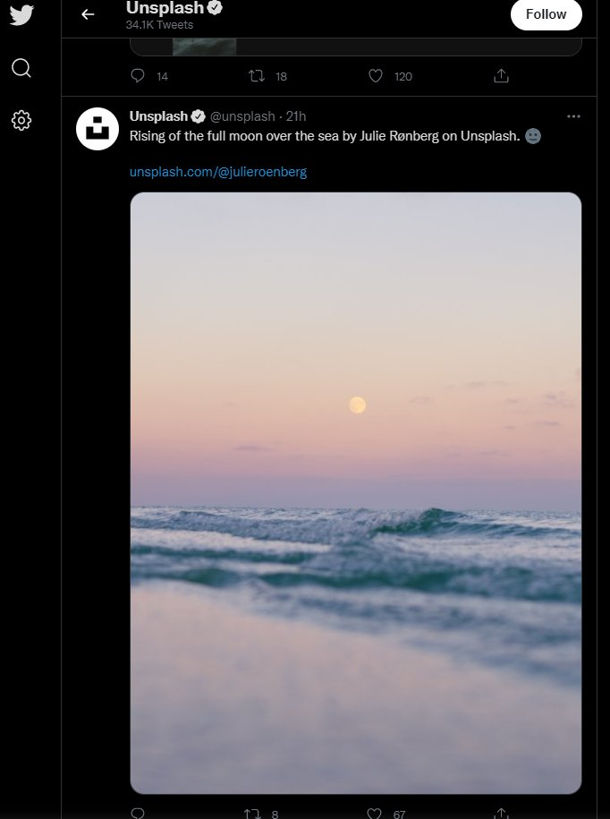

Feature switch
==============

Feature switch는 트위터에서 개발한 기능을 키고끄는 스위치이다. 일부 유저에게만 시험적으로 활성화(A/B 테스팅 등)하는 데 사용하는 것으로 보인다. 또한, 2020년 미국 대선기간동안 트위터에서 [리트윗버튼을 누르면 인용트윗 입력화면으로 바로 넘어갔었는데](https://blog.twitter.com/en_us/topics/company/2020/2020-election-changes), 이를 원래대로 되돌려주는 확장기능 [ReturnRetweet](https://github.com/gaeulbyul/ReturnRetweet)의 작동원리도 바로 이 스위치를 조작하는 것이다.

접근 및 사용
-------

전체 목록은 트위터 웹의 "소스 보기"에서 `window.__INITIAL_STATE__`에서도 드러나나, 이 값은 트위터 로딩과정에 삭제되어서 스크립트나 개발자도구로 접근하기 어렵다. 대신, [Redux store](./redux-store.md)를 통해 접근할 수 있다.

```javascript
reduxStore.getState().featureSwitch.user.config
```

그리고 값을 수정하는 방법은 두가지가 있는데, 하나는 다음과 같이 Redux store에서 얻어온 객체를 수정하는 방법이고,

```javascript
reduxStore.getState().featureSwitch.user.config
  .conversation_controls_change_enabled.value = true
```

아니면 쿠키를 통해 바꿀 수 있다. (`expires`는 적당히 원하는 값으로 적어도 된다. 여러 값을 바꿀때는 구분자로 `&`를 사용한다.)

```javascript
document.cookie = "ab_decider=conversation_controls_change_enabled=true&stateful_login_enabled=false;expires=Tue, 19 Jan 2038 04:14:07 GMT"
```

스위치 정보
------

!!! warning 주의
    여기서 값을 바꾸는 건 단순히 클라이언트 측 변경이며, 서버측에도 반영되는 것은 아니다. 또한 이 스위치들은 사전에 예고없이 추가되거나, 바뀌거나, 사라질 수 있다.

이름만 갖고 쉽게 알 수 있는건 생략한다. (가령, `hashflags_animation_like_button_enabled` 등)

* `c9s_*` - 트위터의 "커뮤니티" 기능 관련 스위치이다. 이 값을 바꾸면 커뮤니티 탭 등 UI는 드러나나 아직은 관련 기능에 접근할 순 없다.
* `conversation_controls_change_enabled` - `true`일 경우 내 트윗에 답글을 달 수 있는 사람을 바꿀수 있는 메뉴가 뜬다.
* `media_minimal_image_crop_enabled` - 타임라인의 섬네일에서 세로로 긴 이미지를 자르지 않도록 한다.
* `responsive_web_article_nudge_enabled` - 기사를 읽지않고 리트윗하려고 할 때 안내문이 뜬다.
* `responsive_web_birdwatch_*` - Birdwatch는 트위터의 가짜정보를 제보하는 기능이다. 한국어 UI번역은 있으나 실제로 기능을 사용할 수는 없더라.
* `responsive_web_reactions_enabled` - 트위터의 새로운 반응 기능. "마음에 들어요"뿐만 아니라 "흐음...", "응원해요", "슬퍼요" 등의 반응을 추가할 수 있다.
* `responsive_web_reply_nudge_enabled`
* `rito_safety_mode_settings_enabled` - 트위터에서 도입예정인 자동차단 관련 기능. 아직 사용할 순 없다.
* `stateful_login_enabled` - `false`면 로그인시 로그인네임과 암호를 함께 입력하고, `true`면 로그인네임 입력 후 암호를 따로 입력한다. (`true`일 때 일부 암호관리자의 자동입력기능이 작동하지 않을 수 있다.)
* `voice_rooms_*` - 트위터 스페이스 관련. 참고로, `voice_consumption_enabled`는 트위터 스페이스가 아니라 음성트윗 기능이다.


### `media_minimal_image_crop_enabled`적용 사진



