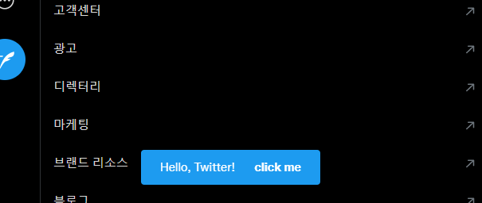

Redux Store
===========

[Redux](https://redux.js.org)는 JavaScript 상태 관리(State management) 라이브러리 중 하나이며, [트위터 웹에서도 사용하고 있는 것](https://blog.twitter.com/engineering/en_us/topics/open-source/2017/how-we-built-twitter-lite)으로 알려져있다. 이 Redux store에 저장된 데이터는 개발자도구나 스크립트를 통해 접근하거나 값을 수정할 수 있다.

접근
--

!!! note 참고
    웹페이지 구조가 바뀌면 아래 코드가 작동하지 않을 수 있다.

다음과 같이 접근할 수 있다. (웹페이지 구조 변경에 따라 작동하지 않을 수 있음에 주의) `getState()`는 plain Object이고 따로 [Immutable.js](https://immutable-js.com)같은 건 도입하지 않은 듯 하다.

```javascript
const reduxStore = document.getElementById('react-root')
  ._reactRootContainer._internalRoot.current
  .child.child.child.child.child.child.child
  .pendingProps.store

// state 가져오기
reduxStore.getState()
```

내부 구조
-----

트위터 웹의 State에는 다음과 같은 키 값이 있다. 전부 다 복사하기엔 양도 많고 모르는 게 많아서 일부만 설명.

* `adFreeArticles`
* `articles`
    * `domains` - `string` 배열. 각종 뉴스/언론사 웹사이트의 도메인이 들어있다. 리트윗 클릭시 "먼저 기사를 읽어주세요" 메시지를 띄울 때 쓰는 용도인듯.
* `audio`
* `badgeCount`
* `cardState`
* `channelsTimelineBehavior`
* `communityMemberships`
* `devices`
* `directMessages`
* `dmComposer`
* `draftTweets`
* `educationFlags`
* `engagementNudges`
* `entities` - 트위터 API에서 가져온 유저정보, 트윗등이 담겨있다. 일종의 캐시인듯.
    * `cards`
    * `commerceItems`
    * `communities`
    * `imageCache`
    * `lists`
    * `liveEvents`
    * `moments`
    * `recommendations`
    * `topics`
    * `translationsTweets`
    * `tweets` - 트윗 ID를 키로 가지는 object. 단, 트윗 작성자(`user`)는 Object가 아니라 유저 ID(string)만 들어있다.
    * `userCommunityInviteActionResult`
    * `userPresence`
    * `users` - 유저 ID를 키로 가지는 object
* `featureSwitch` - [Feature Switch](./feature-switch.md) 항목 참고.
* `friendships`
    * `pendingFollowers` - 팔로우 대기중인 유저 목록?
* `geoLocation`
* `hashflags` - [Hashflag](./hashflag.md) 항목 참고.
* `homeTimeline`
* `instreamVideo`
* `listMemberships`
* `liveTweetCounts`
* `mediaUpload`
* `multiAccount` - 다계정 로그인관련. 현재 로그인한 계정의 정보(`users`)와 알림 갯수(`badgeCounts`)가 있다.
* `navigation`
* `ocf_location`
* `optimist`
* `partnerIdSync`
* `pinnedLists`
* `placePicker`
* `previews`
* `promotedContent`
* `recentSearches`
* `recommendations`
* `savedSearches`
* `session` - 세션 정보. `user_id`는 현재 사용중인 계정의 ID가 있고, 국가(`country`) 및 언어(`language`)도 있다.
* `settings`
    * `dataSaver`
    * `local`
    * `remote`
* `teams`
* `toasts`
* `tweetComposer`
* `typeaheadUsers`
* `typeaheadV2`
* `urt` - 내가 특정 스레드를 열어보거나, 무언가를 검색하거나, 실시간 트렌드를 조회하는 등을 할 때, 어떤 항목이 있는지 목록으로 들어있다.
* `userClaim`
* `visibilityResults`

.dispatch
--------

`.getState()`뿐만 아니라 `.dispatch()`도 작동한다. 가령, 트위터에 toast메시지를 띄울 땐 이렇게 한다.

```javascript
reduxStore.dispatch({
  type: 'rweb/toasts/ADD_TOAST',
  payload: {
    text: 'Hello, Twitter!',
    // action은 메시지 옆구리에 붙는 버튼으로, 이 속성은 없어도 된다.
    action: { 
      label: 'click me',
      onAction() {
        window.alert('Hey!')
      },
    },
  },
})
```

