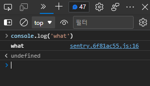

Tips
====

미분류 팁부터 마땅히 써먹을만한 데가 생각나지 않는(...) 잡지식까지.

class가 랜덤 문자열이에요
-----------------

트위터에선 거의 모든 class가 다음과 같이 무작위로 되어있다.

```html
<div class="css-1dbjc4n r-1awozwy r-18u37iz r-1h3ijdo r-1777fci r-1jgb5lz r-1ye8kvj r-ymttw5 r-13qz1uu">
</div>
```

이는 [CSS Modules](https://css-tricks.com/css-modules-part-1-need/) 기법으로 class가 서로 겹치지 않도록 빌드과정에서 무작위로 생성한 것. 다만 부작용(?)으로 확장기능이나 유저스크립트를 만드는 입장에선 웹페이지를 접근하기 난감한 경우가 생길 수 있으며, 주석이라도 안 남기면 뭘 의도한 건지도 알기 어렵다. 내가 만든 확장기능(특히, 미러블락)의 경우 이렇게 생성한 class 사용을 최대한 피하는 편인데, 다행히 트위터에선 class말고 그나마 의미가 있는 속성(`data-testid` 속성이나 `aria-*`등 접근성 관련 속성, `role` 등)이 있다.

* 트윗: `article[data-testid=tweet]`
* 리트윗 버튼: `div[role=button][data-testid=retweet]`
* (팔로워 목록 등에서) 유저: `div[data-testid=UserCell]`

등등...

트위터 routes 접근
-------------

[Redux store](./redux-store.md) 접근하는 방법과 비슷한데, 트위터 웹에서 정의된 routes를 보는 방법도 있다.

```javascript
document.getElementById('react-root')
._reactRootContainer._internalRoot.current
.child.child.child.child.child.child.child
.pendingProps.routes.props.children
```

트윗덱 신버전 (Gryphon) 프리뷰 진입
---------------------

쿠키값을 통해 `tweetdeck_version=beta`로 설정한 후 새로고침한다.

```javascript
document.cookie = `tweetdeck_version=beta;path=/;domain=.twitter.com;max-age=15768000;secure;samesite`
```

출처: [@Basix1120님의 트윗](https://twitter.com/Basix1120/status/1417520044725071878)

###  트윗덱 console 복구



신버전 트윗덱에선 각종 Console API(`console.log`, `console.warn` 등)를 [Sentry](https://sentry.io/)가 수정했더라. 아주 불편한 건 아니지만 콘솔 호출을 원래대로 되돌리려면 `__sentry_original__`에 접근하여 바꾸면 된다.

```javascript
function restoreConsole() {
  const methods = ['debug', 'info', 'warn', 'error', 'log', 'assert']
  methods.forEach(method => {
    if ('__sentry_original__' in console[method]) {
      console[method] = console[method].__sentry_original__
    }
  })
}
```

유저 ID 링크
--------

트위터 유저의 ID만 알고 로그인네임이나 닉네임 등을 모르는 경우, `https://twitter.com/intent/user?user_id=유저ID`를 입력하면 해당하는 유저의 프로필이 열린다.

(예: [https://twitter.com/intent/user?user_id=2594273106](https://twitter.com/intent/user?user_id=2594273106) => [가을별](https://twitter.com/gaeulbyul)의 트위터 프로필)

트윗링크에서 끝에 붙는 s 파라미터 의미
-------------------

트위터를 하면서 링크를 복사하면 원래 트윗주소 끝에 `?s=20`같은게 붙어있곤 한다. 트위터측에서 공식적으로 밝힌건 아니나 내가 알아낸 정보에 따르면,

| `?s=` | OS (m5=웹) | 공유수단        |
| ----- | --------- | ----------- |
| 01    | android   | sms         |
| 02    | android   | email       |
| 03    | android   | gmail       |
| 04    | android   | facebook    |
| 05    | android   | wechat      |
| 06    | android   | line        |
| 07    | android   | fbmessenger |
| 08    | android   | whatsapp    |
| 09    | android   | other       |
| 10    | ios       | sms         |
| 11    | ios       | email       |
| 12    | ios       | other       |
| 13    | android   | download    |
| 14    | ios       | download    |
| 15    | android   | hangouts    |
| 16    | android   | twitterdm   |
| 17    | m5        | email       |
| 18    | m5        | download    |
| 19    | android   | copy        |
| 20    | m5        | copy        |
| 21    | ios       | copy        |
| 22    | ios       | snapchat    |
| 23    | android   | snapchat    |
| 24    | ios       | whatsapp    |
| 25    | ios       | fbmessenger |
| 26    | ios       | facebook    |
| 27    | ios       | gmail       |

[https://twitter.com/gaeulbyul/status/1352574734102220803](https://twitter.com/gaeulbyul/status/1352574734102220803)

트위터 고급검색 구문
-----------

물론 트위터에서도 [고급 검색](https://twitter.com/search-advanced)기능은 제공하나, 모든 구문이 다 들어있진 않더라.
여기에 정리가 잘 되어있다: [Advanced Search on Twitter](https://github.com/igorbrigadir/twitter-advanced-search/blob/master/README.md)

구버전 트위터 화면
----------

트위터에서 React/Redux/... 도입 이전의 UI를 띄울 수 있는 방법이 있다. 바로 [User-Agent](https://developer.mozilla.org/en-US/docs/Web/HTTP/Headers/User-Agent)를 검색 봇(가령, 구글봇 `Mozilla/5.0 (compatible; Googlebot/2.1; +http://www.google.com/bot.html)`)으로 바꾸면 이전버전의 트위터 화면이 나타난다. (다만 실제로 사용할 수 있는 정도는 아니고 그냥 UI를 보는 정도의 의미만...)